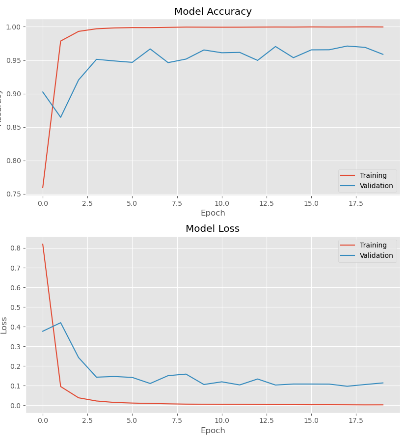
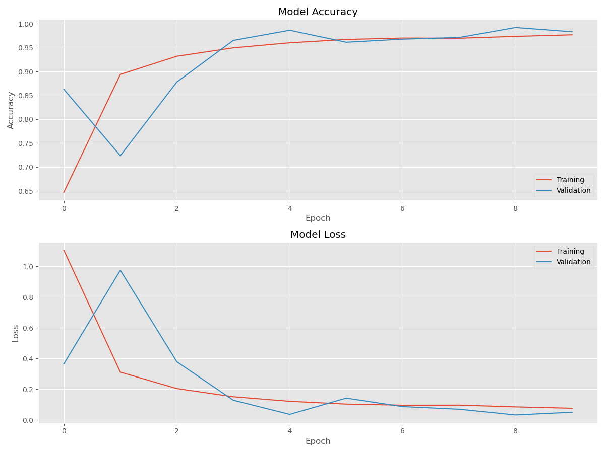
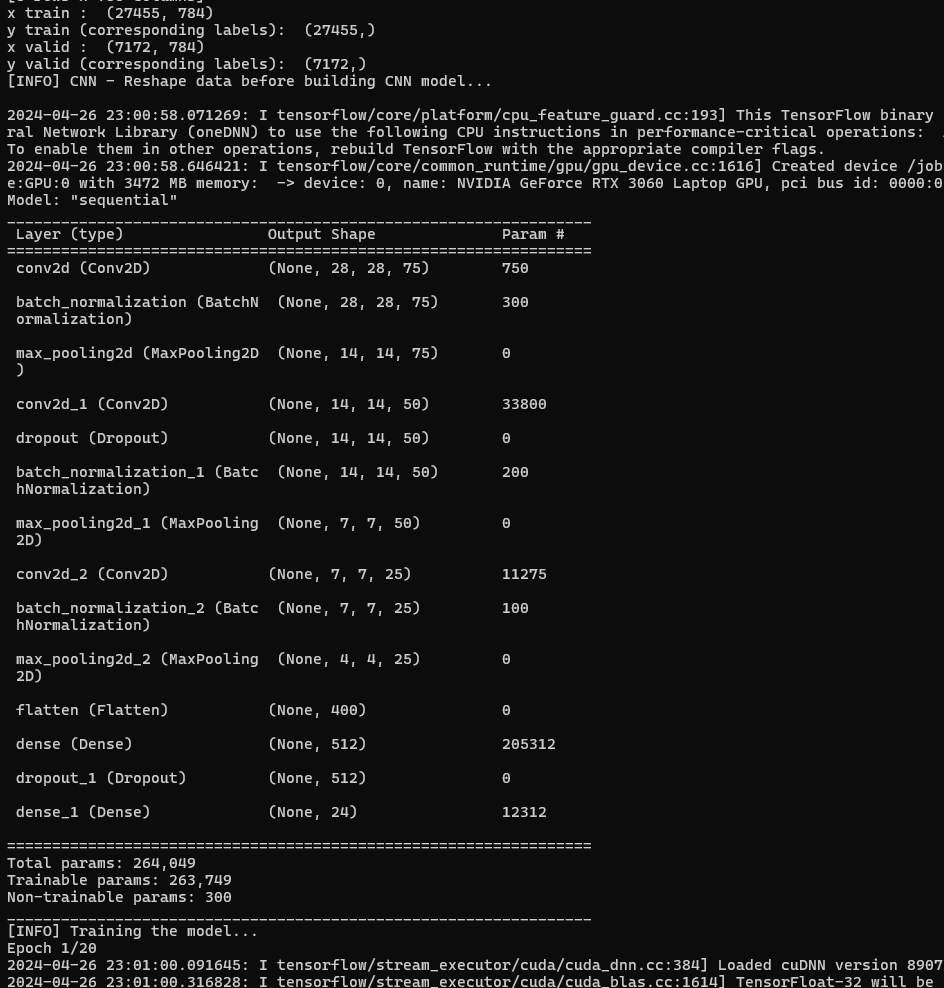

# DeepLearnRTX: Deep Learning with Geforce RTX platform

Deep learning with Tensorflow and OpenCV running on Nvidia GPU enabled platform to accelerate model training and inferencing. 

The following steps automated [Tensorflow installation](https://www.tensorflow.org/install/pip#windows-native_1).

## Environment (Windows Native)
1. Install [Visual Studio C++]( 
https://visualstudio.microsoft.com/vs/olderdownloads/) and [CMake](https://microsoft.github.io/AirSim/build_windows).
2. Install [Anaconda](https://www.anaconda.com/products/individual)
3. Setup the [conda](https://www.anaconda.com/) environment:
```
> conda env create -f environment.yml
> conda activate deeplearn-rtx
```
4. Verify environment using pytest
```
> make test
```
5. Deactivate and switch environment
```
> conda deactivate
> conda env list
> conda activate deeplearn-rtx
```
## Execution

1. Show usages for training with ASL dataset from [Kaggle](https://www.kaggle.com/datasets/datamunge/sign-language-mnist)
```
> python code\asl.py --help
```
2. Kick off model training with (default=CNN model) and 10 epocs (default=20)
```
> python code\asl.py -n 10
```
3. Perform inference with new images, never seen by the trained model and evaluate its performance
```
> python code\asl_predict.py
```

## Model Evaluation

CNN (without Data Augmentation)


CNN (Data Augmentation)



Loss and Accuracy
-----------------
Without Data Augmentation
 - loss: 0.1137 - accuracy: 0.9587
[INFO] Accuracy: 95.87%

Data Augmentation
- loss: 0.0497 - accuracy: 0.9834
[INFO] Accuracy: 98.34%


Model Summary
-------------


## Prediction

Make prediction and classify image using the model saved from previous steps. 

1. Data Augmentation
```
> python code\asl_predict.py -a 1
```

[Info] Predicted: a, Confidence: 0.9958963394165039

[Info] Predicted: b, Confidence: 1.0

[Info] Predicted: y, Confidence: 1.0

[Info] Predicted: f, Confidence: 1.0

[Info] Predicted: t, Confidence: 0.733699381351471

2. Without Data Augmentation
```
> python code\asl_predict.py -a 0
```

[Info] Predicted: a, Confidence: 0.8743960857391357

[Info] Predicted: b, Confidence: 0.9994840621948242

[Info] Predicted: t, Confidence: 0.736053466796875

[Info] Predicted: f, Confidence: 0.749270498752594

[Info] Predicted: o, Confidence: 0.46272599697113037


Deploy
-------------
Deploy trained model to a Web application using the Flask Framework

1. Run Flask App
```
> python deploy\application.py
```

2. Launch Web App in Browser
```
 * Serving Flask app 'application'
 * Debug mode: on
 * Running on http://127.0.0.1:8002
```

3. Select letter image file from data\asl_images folder for classification